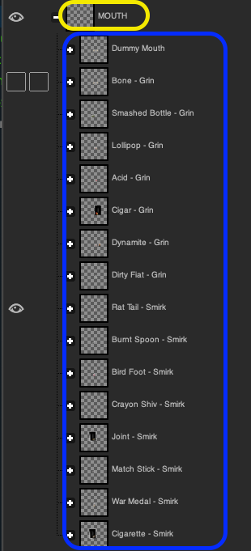

# PSD File

Boots requires the use of a PSD file that contains your collection's traits placed on individual layers. These layers are grouped by the type (or position, i.e. where on the body) of the trait.

<figure><figcaption>
Trait grouping to individual traits
</figcaption></figure>

The yellow oval indicates the trait grouping layer. This would typically correspond to a position on your base NFT, such as it's mouth, or it's body. The items contained within the blue oval hold the variations for this trait group, the actual traits. In the case of the above image, you can see these are the various traits possible for the mouth of this NFT collection.

Zooming out to the root of the PSDs layer stack, you can see how the trait groupings fit into the whole flow of the file. Ensure the ordering of these groups match the visual layering necessary to form your final image. Your final image is constructed from the bottom-up. With the layer groups above being placed on top of the layer group below it in the list.

<figure><figcaption>
Layer stack for the Degenerate Trash Panda collection
</figcaption></figure>

If you have a FINISHERS layer (which typically controls shading, texture, etc), you will keep that layer enabled and at the very top of the layer groups list. The rest of the layer groups and the layers inside the groups should be set to non-visible. Boots will enable each layer and layer group according to the list of requested traits from a user of Boots.
