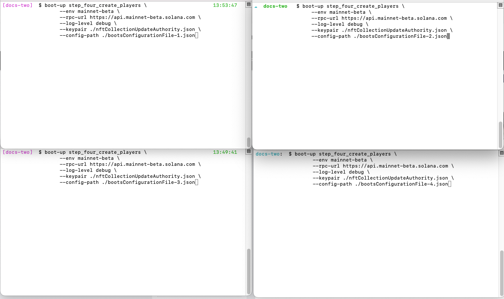

# Step 4 - Create Players

To run, issue the following command:

```
boot-up step_four_create_players \
                   --env mainnet-beta \
                   --rpc-url https://api.mainnet-beta.solana.com \
                   --log-level debug \
                   --keypair ./nftCollectionUpdateAuthority.json \
                   --config-path ./bootsConfigurationFile.json
```

The command line parameters are as follows:

| option                       | description                                                                                                      |
| ---------------------------- | ---------------------------------------------------------------------------------------------------------------- |
| <p>-e,<br>--env</p>          | Which environment to use (devnet, testnet, mainnet-beta, localnet)                                               |
| <p>-r,<br>--rpc-url</p>      | The RPC to use to connect to Solana. This should be a paid RPC, as this application causes heavy use to the RPC. |
| <p>-l,<br>--loglevel</p>     | The log level to use (all, trace, DEBUG, info, warn, error, fatal, off)                                          |
| <p>-k,<br>--keypair</p>      | The keypair which is the update authority for the NFT collection                                                 |
| <p>-cp,<br>--config-path</p> | The path to the configuration file                                                                               |
| <p>-h,<br>--help</p>         | Get help with this command                                                                                       |

The output of the help option is the following:

```
Usage: boot_up step_four_create_players [options]

Options:
  -e, --env <string>           Solana cluster env name (default: "devnet")
  -r, --rpc-url <string>       Solana cluster rpc-url
  -l, --log-level <string>     log level
  -k, --keypair <path>         Solana wallet location
  -cp, --config-path <string>  JSON file with namespace settings
  -h, --help                   display help for command
```

PRO TIP: You can break up the running of Step 4 into parallel processes.  To do this, do the following:

1\) Use an external method to generate your mint list.

2\) Divide the mint list into 4 separate lists. &#x20;

3\)  Create 4 copies of your configuration file

4\) Set the following keys in each of your configuration files:

```
{
  "scope": {
    "type": 0,
    "values": [<subset of mint ids>]
  }
}
```

5\) Open up 4 separate terminals and navigate to the folder with your configuration files and wallet.  Set up the `boot-up step_four_create_players` command in each terminal with a different configuration file for each, like so:

<figure><figcaption></figcaption></figure>

6\) Once each job completes, open up the configuration file for that job and update the "runDuplicateChecks" key to true, and then run the job once more to remove excess items.

After you finish "Step 4 - Create Players" and it successfully completes, you can validate using the Raindrops CLI.  See the next section for an example of how to verify your Player class.
