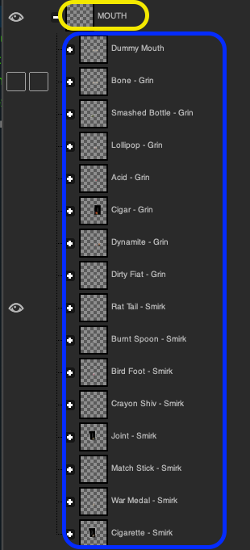
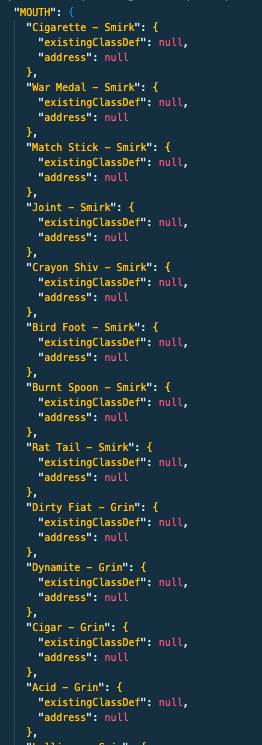

# Configuration File

### scope (object): <a href="#scope-object" id="scope-object"></a>

```json
"scope": {
    "type": 0,
    "values": ["E6rTY8yBATwCH2fykc16yS4rLmvaYdnsfZsStybEacS5"]
},
```

The scope defines what type or set of NFTs you want to establish with Boots. There are currently three options

| Id  | Scope            | values example                                                                                                                                                                                                                                | Description                                                            |
| --- | ---------------- | --------------------------------------------------------------------------------------------------------------------------------------------------------------------------------------------------------------------------------------------- | ---------------------------------------------------------------------- |
| `0` | List of NFTs     | \["GiD1ex1VyEXALniJJvL6KcgQ5mGB4BLzvjM1bQzUXs1T","Cu89qmdY4a6dfUPa9sVZT6W9BTXqZq18d51A5zFGZuG7","4ahpNZJ7pVS85f34ErDXwRmckhmbmvT52ed6kr6J66ZA","ENpscuTJCYReY3NnNcRBJnC7S6pAYbxSfAdcdnJjvxN5","G2fWcgYP49p4J1Db8Jnj3KBJrg1fp1DsfzBo4uJb8u4j"] | A list of NFTs, specified as Mint Ids in the values key                |
| 1   | Candy Machine Id | \["2crTqcmVJVMW6b5z6NEs9HdsKmVc4zDDE2FucNg98kSN"]                                                                                                                                                                                             | Use the Candy Machine Id (i.e. First Creator) to define the collection |
| 2   | Collection Id    | \["CcLrhgWz29JRd3TgxSNEeWwMfMoX9Cz1NQXh27aWUMMx"]                                                                                                                                                                                             | Use the Collection NFT Mint Id                                         |


### runDuplicateChecks (Boolean):

```json
"runDuplicateChecks": false,
```

If this is set to true, the Boot-Up CLI will scan the NFT to make sure that they weren't given more than one of each trait.  This process only applies to NFTs that have reached their final state.

\***IMPORTANT NOTE**\* DO NOT set this to true after the collection is being used by your community.  This will prune duplicate tokens from the Player class of the NFT, so TAKE CAUTION HERE.

### playerStates (object):

```json
"playerStates": null,
```

This serves as a key to save the process of the Boots conversion for your NFTs.  This will be constantly updated during [Step 4 - Create Players](cli-steps/step-4-create-players.md), so the initial value for this key should be set to null. &#x20;

### bodyPartLayers (object):

```json
"bodyPartLayers": ["DUMPSTER", "BODY", "HEAD", "MOUTH", "GLASSES"],
```

This is a whitelisted array of the body parts you would like to enable for boots. These parts can be changed in your collection.

### stringLayers (object):

```json
"stringLayers": ["BACKGROUND", "FUR"],
```

This array is the set of attributes that you do not need to be able to change through Boots. These are things like the base body for your character.  In addition, users will be able to change these items by equipping them as consumable items, and that these will be stored as items on-chain. &#x20;

### newBasicStats (array of objects):

```json
"newBasicStats": [
    {
        "index": 0,
        "name": "mutationLevel",
        "inherited": {
            "notInherited": true
        },
        "statType": {
            "enum": {
                "starting": 0,
                "values": [
                    {
                        "name": "NA",
                        "value": 0
                    },
                    {
                        "name": "Lvl1",
                        "value": 1
                    },
                    {
                        "name": "Lvl2",
                        "value": 2
                    },
                    {
                        "name": "Lvl3",
                        "value": 3
                    },
                    {
                        "name": "Lvl4",
                        "value": 4
                    }
                ]
            }
        }
    }
],
```

This is an array of configuration sets for other non-graphical statistics that you would like to apply to the player class of this collection. The form is described here: [Player - Basic Stats​](../../../contracts/player/basicstats.md)

### itemsWillBeSFTs (boolean):

```json
"itemsWillBeSFTs": true,
```

if true, these items will be created as Semi-Fungible Tokens (SFTs).  The Raindrops protocol only supports SFTs at this time, as Non-Fungible Tokens (NFTs) are prohibitively expensive to use as Items.

### className (text):

```json
"className": "panda",
```

the name of the on-chain class for this collection

### namespaceName (text):

```json
"namespaceName": "dtp",
```

reserved for the namespace for this collection.  Namespaces are currently a work in progress, so stay connected to @only\_raindrops on Twitter for updates.

### skipUpdates (boolean):&#x20;

```json
"skipUpdates": false,
```

Set skipUpdates to True if you do not want the player to be updated with any changes that have happened to the NFT's parent class since the last run.  For instance, if a new layer is desired, or if you want a new statistic applied to this player definition, you would want to keep this set to false. &#x20;

### redoFailures (boolean):

```json
"redoFailures": true
```

Setting this to true means that Boot-Up will retry configuring your NFT for Boots if an error happens during the run.  If you set this to false, the error will propagate up and the next NFT will be tried.  It is recommended to keep this set to true.

### allowTokenHolder (boolean):

```json
"allowTokenHolder": false
```

Set this to true to allow a holder to be able to equip their NFT in this collection.  If false, then the collection owner must be the one to equip the collection NFTs.  In addition, fees for equipping items can be **circumvented** if this is set to true.&#x20;

### itemClassLookup (object):

```json
 "itemClassLookup": {
    "DUMPSTER": {
      "BLACK": {
        "existingClassDef": null,
        "address": null
      },
      "RED": {
        "existingClassDef": null,
        "address": null
      },
      "GREEN": {
        "existingClassDef": null,
        "address": null
      },
      ...
    },
    "MOUTH": {
      "Cigarette - Smirk": {
        "existingClassDef": null,
        "address": null
      },
      "War Medal - Smirk": {
        "existingClassDef": null,
        "address": null
      },
      "Match Stick - Smirk": {
        "existingClassDef": null,
        "address": null
      },
      "Joint - Smirk": {
        "existingClassDef": null,
        "address": null
      },
      "Crayon Shiv - Smirk": {
        "existingClassDef": null,
        "address": null
      },
      "Bird Foot - Smirk": {
        "existingClassDef": null,
        "address": null
      },
      "Burnt Spoon - Smirk": {
        "existingClassDef": null,
        "address": null
      },
      "Rat Tail - Smirk": {
        "existingClassDef": null,
        "address": null
      },
      "Dirty Fiat - Grin": {
        "existingClassDef": null,
        "address": null
      },
      "Dynamite - Grin": {
        "existingClassDef": null,
        "address": null
      },
      "Cigar - Grin": {
        "existingClassDef": null,
        "address": null
      },
      "Acid - Grin": {
        "existingClassDef": null,
        "address": null
      },
      "Lollipop - Grin": {
        "existingClassDef": null,
        "address": null
      },
      "Smashed Bottle - Grin": {
        "existingClassDef": null,
        "address": null
      },
      "Bone - Grin": {
        "existingClassDef": null,
        "address": null
      }
    }
  }
```

This is where you are defining the items that will be able to be equipped on your players. It is an abstraction of a layered set of images defined within a .PSD file. They MUST match the layer names in your base .PSD file in order for the Boots image processor to find the correct layer. Here is an example of this concept:

<div>

<figure><figcaption><p>PSD Layers</p></figcaption></figure>

 

<figure><figcaption><p>ItemClassLookup</p></figcaption></figure>

</div>

The yellow border is the name of the parent layer for the attribute, and the blue border shows the options for that layer. And you can see on the itemClassLookup that the MOUTH layer is the key for this itemClassLookup, and each key of the corresponding object has the name of the layer you want to enable.

For each image layer, you will add a default boilerplate entry.&#x20;

```json
{ "existingClassDef": null, "address": null }
```

The layer will be populated by Boot-Up with the configuration, so leave it defined as is.

In addition, this is where the [bodyPartLayers](configuration-file.md#bodypartlayers-object) comes into play. If you want to enable creating NFTs or SFTs for these items you will need to whitelist them in the [bodyPartLayers](configuration-file.md#bodypartlayers-object) key.

### itemImageFile (string):

```json
"itemImageFile": "/Users/myUser/Documents/pandaItems/",
```

This is the location of the directory that holds the images for the individual items. When the process runs, it will create the NFT or SFT on chain for you, and this is where you have the image files specified.

NAMING CONVENTION FOR THE IMAGE FILES

Because the system needs to be able to find the files in your file system, you will need to follow a character substitution pattern when you name your image files. In general, use an underscore ( \_ ) character to substitute for whitespace, and replace any special characters as follows:

| character                      | replace with |
| ------------------------------ | ------------ |
| whitespace (spaces, tabs, etc) | "\_"         |
| pipe (\|)                      | ":"          |
| colon (:)                      | ""           |
| forward slash (/)              | ":"          |

So a layer named

"EXALTED\_STAT | RUGGED\_COUNT: 2"

would end up with an image file named

"EXALTED\_STAT\_\_RUGGED\_COUNT\_2.png"​

### collectionMint (publicKey) <a href="#collectionmint-publickey" id="collectionmint-publickey"></a>

```json
"collectionMint": "GoLMLLR6iSUrA6KsCrFh7f45Uq5EHFQ3p8RmzPoUH9mb",
```

This is the mint id for the collection that you intend to enable with Boots.

### index (integer) <a href="#index-integer" id="index-integer"></a>

```json
"index": 0
```

Raindrops allows each NFT in principle to have multiple items and players defined on top of it through the use of indexing. Therefore, for each Boots collection, you must label which index you decided to use for the items and the NFTs themselves.

### itemIndex (integer) <a href="#itemindex-integer" id="itemindex-integer"></a>

```json
"itemIndex": 0,
```

Raindrops allows each NFT in principle to have multiple items and players defined on top of it through the use of indexing. Therefore, for each Boots collection, you must label which index you decided to use for the items and the NFTs themselves.

### existingItemClassDef (object) <a href="#existingitemclassdef-object" id="existingitemclassdef-object"></a>

```json
"existingItemClassDef": null,
```

This is where the CLI will store the class information for the Items class of the collection. This is automatically populated by the application, so just leave it at `null` to start.  In general, this specifies the abstract top level class of the ItemsCollection.  The ItemClasses for the collection inherit their properties from this ItemsCollection, and then each Item inherits properties from its ItemClass.  For more information on how Items are composed, have a look at that section of the [Raindrops documentation](../../../contracts/item/).

### existingClassDef (object) <a href="#existingclassdef-object" id="existingclassdef-object"></a>

```json
"existingClassDef": null,
```

This is where the application will store the class information for the collection's main class. This is populated by the application.

### itemsName (string) <a href="#itemsname-string" id="itemsname-string"></a>

```json
"itemsName": "DTP Items",
```

This will be the name of the collection NFT for the class.  When the application creates the collection NFT for Boots, this is the name it will apply to the Collection NFT.

### existingCollectionForItems (public key) <a href="#existingcollectionforitems-public-key" id="existingcollectionforitems-public-key"></a>

```json
"existingCollectionForItems": null,
```

This is the public key for the Collection NFT of the items for the collection. This is populated by the application.
